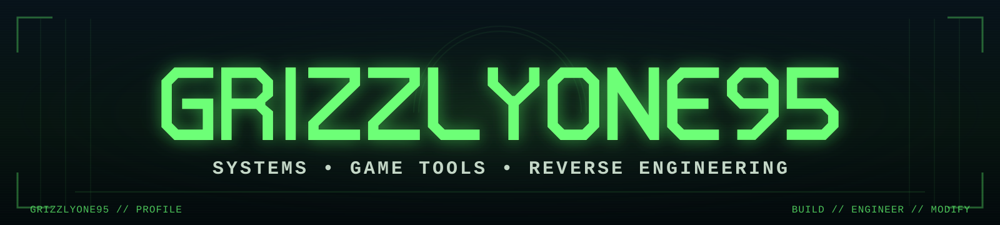

  

<h1 align="center">GrizzlyOne95</h1>

  <strong>Network Administrator · Developer · Game Tools & Reverse Engineering</strong>

  I build tools, modernize old games, automate infrastructure, and take software apart far enough to understand how it really works.

  
  
  
  

---

## Tech & Tools

  <code></code>&nbsp;
  <code></code>&nbsp;
  <code></code>&nbsp;
  <code></code>&nbsp;
  <code></code>&nbsp;
  <code></code>&nbsp;
  <code></code>&nbsp;
  <code></code>&nbsp;
  <code></code>&nbsp;
  <code></code>

  
  
  
  
  
  
  

---

## Featured Work

### Battlezone 98 Redux

My primary game-development and reverse-engineering work centers on **Battlezone 98 Redux**: native runtime extensions, compatibility fixes, graphics modernization, performance analysis, modding APIs, content pipelines, mission scripting, and developer tooling.

  
  
  

**OpenShim** — Native compatibility and enhancement layer for Battlezone 98 Redux, including engine reverse engineering, runtime patching, rendering work, performance instrumentation, UI extensions, compatibility fixes, and additional modding capabilities.

**Campaign Reimagined** — Modernization and expansion of the original Battlezone campaign using enhanced scripting, effects, rendering, mission logic, assets, and quality-of-life improvements.

### Battlezone Tooling

  
  
  

  
  
  

---

## Other Work

### Gears of War Research

Reverse engineering and research aimed at reconstructing and understanding native PC execution paths for **Gears of War: Judgment** using the UE3-era Gears PC codebase.

### Game Development

I also work with **Unreal Engine**, **Blender**, **Substance 3D Painter**, and supporting asset/content pipelines for original game-development projects.

### Systems & Infrastructure

My professional work is primarily systems and network administration, including Windows infrastructure, Active Directory and Group Policy, Microsoft 365, Remote Desktop Services, Hyper-V, backup and disaster recovery, network/security administration, mobile-device management, PowerShell/Python automation, and EDI integrations.

---

## More

The full project catalog, Battlezone work, media, tools, mods, and other research are organized on my portfolio site:

  

