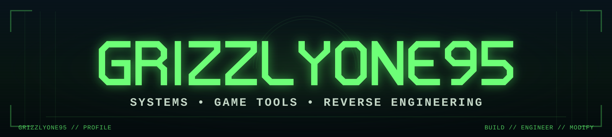

  

<h1 align="center">GrizzlyOne95</h1>

  <strong>Network Administrator · Developer · Game Tools & Reverse Engineering</strong>

  I build tools, modernize old games, automate infrastructure, and take software apart far enough to understand how it really works.

  
  
  
  

---

## Tech & Tools

  <code></code>&nbsp;
  <code></code>&nbsp;
  <code></code>&nbsp;
  <code></code>&nbsp;
  <code></code>&nbsp;
  <code></code>&nbsp;
  <code></code>&nbsp;
  <code></code>&nbsp;
  <code></code>&nbsp;
  <code></code>

  
  
  
  
  
  
  

---

## Featured Work

### Battlezone 98 Redux

My primary open-source work centers on **Battlezone 98 Redux**: runtime patches, engine reverse engineering, mission scripting, native Lua extensions, content modernization, multiplayer tooling, and mod-development workflows.

  
  
  

**[OpenShim](https://github.com/GrizzlyOne95/Battlezone98Redux_Shim)** is an open-source runtime patch and compatibility layer for Battlezone 98 Redux, providing engine-level fixes, restored behavior, multiplayer fixes, modding extensions, and opt-in native features beyond the stock mod API.

**[Campaign Reimagined](https://github.com/GrizzlyOne95/Battlezone98Redux_CampaignReimagined)** is an experimental campaign overhaul and community patch combining rewritten Lua mission logic, shared gameplay systems, replacement content, renderer work, and native engine extensions.

**[Extra Utilities](https://github.com/GrizzlyOne95/ExtraUtilities)** is a native Lua extension exposing engine, renderer, UI, object, multiplayer, environment, and gameplay controls not available through the stock mission API.

**[bzfile](https://github.com/GrizzlyOne95/bzfile)** provides Lua-facing file I/O and supporting update/integrity functionality for Redux mods and addon tooling.

### Battlezone Modding Tools

  
  
  

**[Battlezone 98 Modding Toolbox](https://github.com/GrizzlyOne95/Battlezone98_Modding_Toolbox)** is the consolidated all-in-one workspace for Battlezone 98 Redux projects. It brings mission/BZN inspection, ODF validation, dependencies, terrain/world workflows, texture and graphics conversion, model tools, audio, localization, archives, and Steam Workshop publishing into one application.

**[Battlezone Mod Engine](https://github.com/GrizzlyOne95/Battlezone_ModEngine)** is a cross-platform Steam Workshop downloader and mod manager for non-Steam Battlezone 98 Redux and Battlezone Combat Commander installations, with Windows, Linux, and macOS release builds.

**[Battlezone Blender Toolkit](https://github.com/GrizzlyOne95/Battlezone_BlenderToolKit)** is a full Blender import/export and authoring suite for classic Battlezone, The Red Odyssey, and Battlezone 98 Redux workflows, covering legacy and Redux models, terrain, archives, validation, and authoring helpers.

---

## Public Project Catalog

These are the current public project repositories behind the portfolio, excluding this profile repository and the portfolio-site repository itself.

### Battlezone Runtime, Mods & Community Tools

| Repository | Focus |
| --- | --- |
| **[Battlezone98Redux_Shim](https://github.com/GrizzlyOne95/Battlezone98Redux_Shim)** | OpenShim runtime patch, compatibility layer, reverse engineering, fixes, and native extensions for Redux. |
| **[Battlezone98Redux_CampaignReimagined](https://github.com/GrizzlyOne95/Battlezone98Redux_CampaignReimagined)** | Integrated campaign overhaul, mission rewrites, assets, rendering work, shared Lua systems, and native-extension integration. |
| **[ExtraUtilities](https://github.com/GrizzlyOne95/ExtraUtilities)** | Native Lua API exposing additional engine, renderer, UI, object, multiplayer, and gameplay controls. |
| **[bzfile](https://github.com/GrizzlyOne95/bzfile)** | Lua-facing file I/O library and supporting integrity/update functionality for Redux mods. |
| **[Battlezone_LobbyMonitor](https://github.com/GrizzlyOne95/Battlezone_LobbyMonitor)** | External Battlezone 98 Redux multiplayer lobby monitor, client, Discord bridge, automation, and activity tooling. |
| **[Battlezone1.5_Shim-](https://github.com/GrizzlyOne95/Battlezone1.5_Shim-)** | Narrow compatibility shim for Battlezone 1.5 fullscreen menus, HUD scaling, and legacy menu video behavior. |

### Modding, Content & Blender Tooling

| Repository | Focus |
| --- | --- |
| **[Battlezone98_Modding_Toolbox](https://github.com/GrizzlyOne95/Battlezone98_Modding_Toolbox)** | Consolidated Battlezone 98 Redux modding workspace for missions, terrain, validation, assets, archives, and Workshop publishing. |
| **[Battlezone_ModEngine](https://github.com/GrizzlyOne95/Battlezone_ModEngine)** | Cross-platform Workshop mod downloader and manager for Battlezone 98 Redux and Combat Commander. |
| **[Battlezone_BlenderToolKit](https://github.com/GrizzlyOne95/Battlezone_BlenderToolKit)** | Blender authoring suite for classic Battlezone, Red Odyssey, and Redux assets and terrain. |
| **[io_scene_bz2msh](https://github.com/GrizzlyOne95/io_scene_bz2msh)** | Blender importer for Battlezone II / Combat Commander MSH assets, including animation, PAK, materials, and texture support. |
| **[io_scene_bz2xsi](https://github.com/GrizzlyOne95/io_scene_bz2xsi)** | Blender importer/exporter for Battlezone II / Combat Commander XSI assets, including animation, envelopes, PAK browsing, and Softimage PIC support. |
| **[BlenderUVAtlasGenerator](https://github.com/GrizzlyOne95/BlenderUVAtlasGenerator)** | Blender UV-atlas generator that consolidates shader materials while preserving existing UV layouts and islands. |
| **[BZNTools](https://github.com/GrizzlyOne95/BZNTools)** | Reference-oriented Battlezone BZN format documentation and parser implementation retained for reverse-engineering value. |

### Preservation, Extraction & Reverse Engineering

| Repository | Focus |
| --- | --- |
| **[Battlezone_PSPExtractor](https://github.com/GrizzlyOne95/Battlezone_PSPExtractor)** | Extraction, format research, gameplay reverse engineering, and port-oriented tooling for Battlezone PSP. |
| **[Battlezone_Gold_Extractor](https://github.com/GrizzlyOne95/Battlezone_Gold_Extractor)** | Asura-engine archive, model, texture, and audio extraction/reverse-engineering toolkit for Battlezone Gold Edition (2017). |
| **[Battlezone2_ArtAssets](https://github.com/GrizzlyOne95/Battlezone2_ArtAssets)** | Preservation and reconstruction tooling for original Battlezone II Softimage-era art sources. |
| **[GearsJudgement_PCNative](https://github.com/GrizzlyOne95/GearsJudgement_PCNative)** | Original tooling and technical research toward a native PC port of Gears of War: Judgment. |

---

## Game Development & 3D Work

Alongside Battlezone and reverse-engineering projects, I work with **Unreal Engine**, **Blender**, and **Substance 3D Painter** on original game-development, modeling, materials, conversion, and asset-pipeline work.

A growing portion of the Battlezone tooling above also comes directly from that 3D workflow: model reconstruction, format conversion, UV/material processing, Blender import/export, terrain authoring, and preservation of legacy content.

---

## Systems & Infrastructure

My professional work is primarily systems and network administration, including Windows infrastructure, Active Directory and Group Policy, Microsoft 365, Remote Desktop Services, Hyper-V, backup and disaster recovery, network/security administration, mobile-device management, PowerShell/Python automation, and EDI integrations.

---

## More

The portfolio site organizes the broader project catalog, media, mods, artwork, and research:

  

